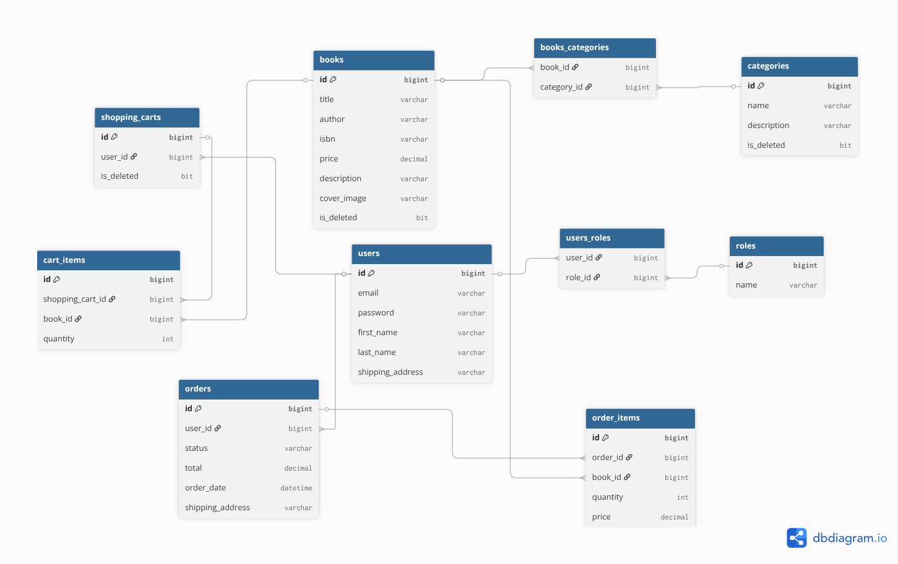
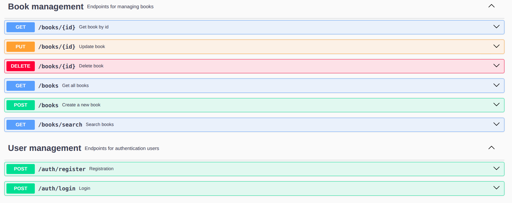
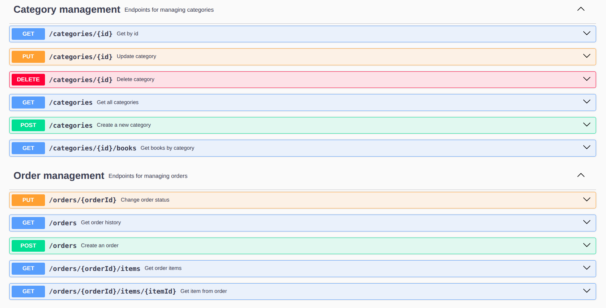
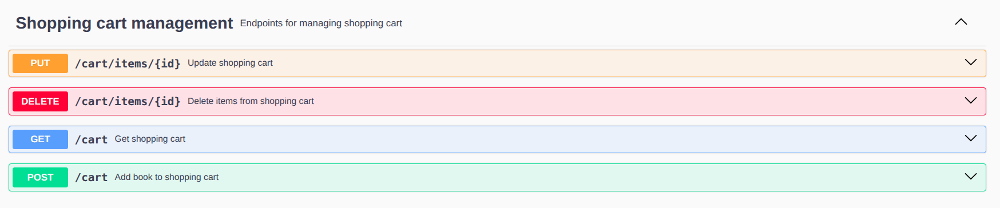

#  Online Book Store API


A fully-featured REST API for managing an online bookstore built with Spring Boot.

The application provides secure authentication and authorization, book catalog management, shopping cart functionality, order processing, and API documentation. It was designed following clean architecture principles and modern backend development practices.


---

#  Project Overview

Online Book Store is a backend REST application that simulates a real-world e-commerce platform for selling books.

The system allows users to browse books, manage shopping carts, place orders, and track order history. Administrators can manage books and categories through secured endpoints.

The project focuses on:

* Secure authentication and authorization
* Clean layered architecture
* Database versioning and migrations
* RESTful API design
* DTO-based communication
* Automated mapping
* Scalability and maintainability

---

#  Features

##  Authentication & Authorization

* User registration
* User login
* JWT Authentication
* Role-based access control
* Spring Security integration
* Protected endpoints

##  Book Management

* Create books
* Update books
* Delete books
* Browse all books
* View book details
* Pagination support
* Sorting support
* Search functionality

##  Category Management

* Create categories
* Update categories
* Delete categories
* Retrieve category details
* Retrieve books by category

##  Shopping Cart

* Add books to cart
* Update quantity
* Remove books from cart
* View current shopping cart

##  Orders

* Create orders
* View order history
* View order details
* Order status tracking

##  API Documentation

* Swagger UI integration
* OpenAPI specification

---

#  Architecture

The project follows a layered architecture:


### Project Layers

**Controllers**

* Handle HTTP requests
* Validate incoming data
* Return API responses

**Services**

* Business logic implementation
* Data processing
* Transaction management

**Repositories**

* Database communication
* CRUD operations

**Database**

* MySQL
* Managed through Liquibase migrations

---

# Technologies

| Category         | Technology         |
| ---------------- |--------------------|
| Language         | Java 21            |
| Framework        | Spring Boot        |
| Security         | Spring Security    |
| Authentication   | JWT                |
| Database         | MySQL              |
| ORM              | Hibernate          |
| Data Access      | Spring Data JPA    |
| Migrations       | Liquibase          |
| Documentation    | Swagger / OpenAPI  |
| Mapping          | MapStruct          |
| Validation       | Jakarta Validation |
| Testing          | JUnit 5            |
| Build Tool       | Maven              |
| Containerization | Docker Compose     |

---

# Database Model



Core entities:

* User
* Role
* Book
* Category
* ShoppingCart
* CartItem
* Order
* OrderItem

### Relationships

* One User → One Shopping Cart
* One User → Many Orders
* One Category → Many Books
* One Shopping Cart → Many Cart Items
* One Order → Many Order Items

---

# API Endpoints

## Authentication

| Method | Endpoint           |
| ------ | ------------------ |
| POST   | /api/auth/register |
| POST   | /api/auth/login    |

## Books

| Method | Endpoint        |
| ------ | --------------- |
| GET    | /api/books      |
| GET    | /api/books/{id} |
| POST   | /api/books      |
| PUT    | /api/books/{id} |
| DELETE | /api/books/{id} |

## Categories

| Method | Endpoint             |
| ------ | -------------------- |
| GET    | /api/categories      |
| GET    | /api/categories/{id} |
| POST   | /api/categories      |
| PUT    | /api/categories/{id} |
| DELETE | /api/categories/{id} |

## Shopping Cart

| Method | Endpoint                  |
| ------ | ------------------------- |
| GET    | /api/cart                 |
| POST   | /api/cart                 |
| PUT    | /api/cart/cart-items/{id} |
| DELETE | /api/cart/cart-items/{id} |

## Orders

| Method | Endpoint               |
| ------ | ---------------------- |
| GET    | /api/orders            |
| POST   | /api/orders            |
| GET    | /api/orders/{id}/items |
| PATCH  | /api/orders/{id}       |

---

# Getting Started

## Clone Repository

```bash
git clone https://github.com/YOUR_USERNAME/online-book-store.git
cd online-book-store
```

## Configure Database

Update application.properties:

```properties
spring.datasource.url=jdbc:mysql://localhost:3306/book_store
spring.datasource.username=your_mysql_user
spring.datasource.password=your_mysql_password
```

## Build Project

```bash
mvn clean install
```

## Run Application

```bash
mvn spring-boot:run
```

Application will start on:

```text
http://localhost:8080
```

---

# Docker Setup

## Overview

This project uses Docker Compose to run:

* MySQL 8.0 database
* Spring Boot application
* Environment variables loaded from a `.env` file

The application connects to MySQL using the variables defined in the `.env` file.

## Environment Configuration

### `.env.sample`

A template file containing all required environment variables:

```env
MYSQLDB_USER=
MYSQLDB_PASSWORD=
MYSQLDB_ROOT_PASSWORD=
MYSQLDB_DATABASE=

MYSQLDB_LOCAL_PORT=
MYSQLDB_DOCKER_PORT=

SPRING_LOCAL_PORT=
SPRING_DOCKER_PORT=
DEBUG_PORT=
```

Create your local environment file:

```bash
cp .env.sample .env
```

Then fill in all required values.

## Environment Variables Mapping

The project uses the `MYSQLDB_*` prefix.

These variables are mapped in `docker-compose.yml` to the official MySQL environment variables:

```yaml
MYSQL_ROOT_PASSWORD=${MYSQLDB_ROOT_PASSWORD}
MYSQL_USER=${MYSQLDB_USER}
MYSQL_PASSWORD=${MYSQLDB_PASSWORD}
MYSQL_DATABASE=${MYSQLDB_DATABASE}
```

## Running the Application

1. Copy the sample environment file:

```bash
cp .env.sample .env
```

2. Fill in all required values in `.env`.

3. Build and start the containers:

```bash
docker compose up --build
```

## Accessing the Application

The application will be available at:

```text
http://localhost:${SPRING_LOCAL_PORT}
```

Example:

```text
http://localhost:8088
```


---

# Swagger Documentation

Swagger UI is available at:

```text
http://localhost:8080/swagger-ui/index.html
```




---

# Testing

Run all tests:

```bash
mvn test
```

The project contains unit and integration tests covering core business functionality.

---


# Demo Video

Loom walkthrough:

[Add Loom video link here]

The demo presents:

* User registration
* User authentication
* Swagger documentation
* Book management
* Shopping cart workflow
* Order creation process


